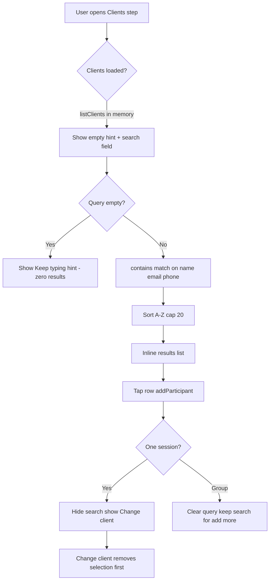

# Client search UX study and enhancements

## Current behavior (what exists today)

### Primary: Roster composer client search
The only real type-to-search client experience is Step 1 of the roster composer ([`people_section.dart`](lib/features/rostering/presentation/composer/sections/people_section.dart) + [`roster_composer_controller.dart`](lib/features/rostering/presentation/composer/roster_composer_controller.dart)).

**Mechanics**
- In-page command search (not overlay autocomplete) — intentional, avoids scroll fights with the parent `ListView`.
- Match: case-insensitive `contains` on `fullName`, `email`, `phone`.
- Empty query → **no results** (“Keep typing to filter…”).
- Cap **20**, A–Z sort (not relevance).
- One-session: after pick, search hides; **Change client** clears selection then reopens search.
- Group: search stays; already-selected clients are excluded.
- Source: full `listClients()` loaded at bootstrap (client-side filter only).

### Elsewhere: not search bars
| Surface | Pattern | Friction |
|---------|---------|----------|
| Visits board | Non-searchable client dropdown | Long lists hard to scan |
| Billing Create/Ageing | Same dropdown pattern | Host vs participant + no typeahead |
| Job form | Client dropdown | Same |
| Clients directory | Status chips only | No name search at all |
| Shared `ClientPicker` | **Missing** | Duplicated helpers |

NDIS catalogue picker ([`ndis_support_item_picker.dart`](lib/shared/widgets/ndis_support_item_picker.dart)) is a closer “good pattern” sibling (local filter, clear selection tile, count feedback) but is catalogue-specific.

---

## Why it feels hard (friction map)

1. **Blank until you type** — Empty query shows nothing. Users who want to browse, confirm spelling, or pick a recent client must invent a query first. Combined with the second empty hint, the step feels empty and demanding.
2. **Two competing empty states** — “No client selected yet…” card **and** “Keep typing…” under the field. Same job, twice.
3. **Change client is destructive** — One-session flow removes the person before you pick the next. Feels like losing work; no side-by-side “replace” path.
4. **Weak ranking** — `contains` + A–Z means typing `"jo"` can bury `Jordan` under alphabetically earlier partial matches; starts-with / token matches are not preferred.
5. **Phone matching is brittle** — Digits with spaces/`+61` won’t match stored formats cleanly.
6. **No truncation feedback** — Cap 20 with no “Showing 20 — refine search” when more exist.
7. **Results grow the page** — Unbounded inline list pushes Next / later sections down; no max-height scroll region.
8. **No keyboard path** — No ↑↓ / Enter to select; mobile-first but staff desktop use suffers.
9. **No loading / empty-directory states on the field** — If clients are still hydrating or the tenant has zero clients, the field looks ready but yields nothing useful.
10. **Inconsistent app-wide** — Board/billing/job still use raw dropdowns, so “finding a client” feels different (and often harder) outside the composer.

---

## Recommended enhancement path (concrete)

Scope this as **composer-first polish**, then a **shared searchable picker** reused by board/billing/job. Do not invent a marketing-style redesign; stay within [`DESIGN.md`](DESIGN.md) (task-first, teal chrome, dense).

### Phase 1 — Composer search (highest impact, local to people step)

**A. Smarter empty / idle state**
- On focus with empty query: show **recently used / recently rostered clients** (last ~8 from local prefs or recent shifts), not a blank “keep typing” wall.
- If no recents: show first ~8 A–Z with label “Browse clients” + still filter as they type.
- Collapse the big `_EmptyClientHint` into one short helper under the field (remove duplicate card).

**B. Better matching and ranking**
- Tokenize query; match any name token (so `"smith j"` ≈ John Smith).
- Rank: starts-with name > token starts-with > contains; then email/phone.
- Normalize phone digits before compare.
- When results truncated: muted line `Showing 20 of N — type more to narrow`.

**C. Scannable results container**
- Wrap results in a max-height (~240–280px) scrollable list so the wizard footer / Next stays reachable.
- Keep photo + subtitle (email · phone · address) — already good for duplicate names.
- Subtle highlight of the matched substring in the name.

**D. Change-client without wipe**
- One-session: tapping **Change client** keeps the current selection visible and opens search in “replace” mode; selecting a new client swaps in one action (only remove if they clear without picking).

**E. Micro-affordances**
- Autofocus search when the Clients step opens and no client is selected.
- Show spinner/disabled hint while `isHydrating` / clients empty.
- Enter selects the top match when exactly one strong match (or focused row).

### Phase 2 — Shared searchable client control

Extract a small shared widget (e.g. `ClientCommandSearch` / `SearchableClientField`) used by:
- Composer people section
- Visits board client filter
- Billing host/participant filters
- Job form client field
- Optionally Clients list header search

API shape: query → ranked `ClientOut` (or `{id,name}`) from an in-memory list + optional `recentIds`, same matching helpers as Phase 1. Keep **in-page results** (not Overlay) for forms inside scroll views; board filter can use a compact dropdown-with-search or bottom sheet on narrow widths.

### Phase 3 — Directory search
Add a simple name/email/phone filter field on [`clients_list_view.dart`](lib/features/clients/views/clients_list_view.dart) using the same matcher — biggest win when the tenant list is long.

---

## Out of scope for this pass
- Server-side typeahead / pagination API (current `listClients` in memory is enough until tens of thousands of clients).
- Replacing NDIS catalogue picker (already a local-filter typeahead).
- Visual brand overhaul beyond search ergonomics.

---

## Success criteria
- Pick a known client in ≤2 interactions when they appear in recents.
- Change client without an intermediate “no client selected” dead state.
- Typing 2–3 characters surfaces the intended person near the top for typical names.
- Board/billing client pick no longer requires scrolling a raw dropdown for large orgs.
- Copy stays short and utility-first per DESIGN.md.
