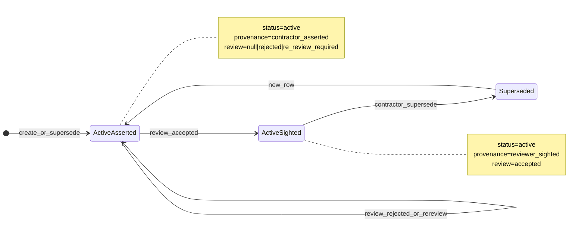

# Credential status + review alignment

## Verdict

Your root-cause read is correct. **Lifecycle `status` is never `accepted`/`rejected`.** Acceptance is stored as:

- `workforce.credentials.status = active` (unchanged)
- `workforce.credentials.provenance_state = reviewer_sighted` (only on Accept)
- `workforce.provider_credential_reviews.decision = accepted|rejected|re_review_required`

Staff FE seeds Accept/Reject/Re-review from `credential.status ∈ {accepted, rejected, re_review_required, pending}` in [`staff_credential_review_controller.dart`](lib/features/credentials/controllers/staff_credential_review_controller.dart) (`_seedDecisionsFromStatus`). After Accept, status stays `active`, so reload (or cold open) treats the row as undecided → Accept/Reject stay enabled while the provenance chip correctly shows “Accepted by reviewer”.

**Field FE must use for button enablement:** engagement-scoped **`provider_credential_reviews.decision`** (expose as `review_decision` on the staff credential payload). Use `provenance_state` only for the Review chip / contractor “awaiting vs accepted” UX and for clearing decisions after supersede (`contractor_asserted`). Do **not** use lifecycle `status` for review buttons.

---

## BE source of truth

DB: [`timesheet-db/migrations/V012__credentials_and_evidence.sql`](C:/Users/DELL3561/Desktop/new%20projects/flutter%20backend/timesheet/timesheet-db/migrations/V012__credentials_and_evidence.sql)  
App: [`categories.py`](C:/Users/DELL3561/Desktop/new%20projects/flutter%20backend/timesheet/timesheet-backend/app/modules/credentials/categories.py), [`service_review.py`](C:/Users/DELL3561/Desktop/new%20projects/flutter%20backend/timesheet/timesheet-backend/app/modules/credentials/service_review.py), [`service.py`](C:/Users/DELL3561/Desktop/new%20projects/flutter%20backend/timesheet/timesheet-backend/app/modules/credentials/service.py), [`service_eligibility.py`](C:/Users/DELL3561/Desktop/new%20projects/flutter%20backend/timesheet/timesheet-backend/app/modules/credentials/service_eligibility.py)

### Credential `status` (lifecycle only)

| Value | Meaning |
|-------|---------|
| `active` | Current row; reviewable; listed |
| `superseded` | Replaced by a newer credential row; omitted from list/eligibility |
| `withdrawn` | Allowed by CHECK; no credential service path sets it today |

**Not** credential statuses: `accepted`, `rejected`, `pending`, `re_review_required`, `draft`.

### `provenance_state` (trust / sighting ladder)

| Value | Meaning |
|-------|---------|
| `contractor_asserted` | Default on create/supersede; awaiting provider sighting |
| `document_extracted` | Machine extraction (not used by review Accept path) |
| `reviewer_sighted` | Set **only** when engagement review decision = `accepted` (unless already issuer/registry verified) |
| `issuer_verified` / `registry_verified` | Deferred elevated trust; Accept does not downgrade these |

There is **no** BE provenance value for rejected / re-review. FE labels like `rejected` / `reviewer_rejected` / `verified` / `self_reported` are FE-only aliases and are not written by BE.

### Engagement review `decision` (`POST …/credential-reviews`)

| Decision | Writes review row? | Changes `status`? | Changes `provenance_state`? |
|----------|--------------------|-------------------|-----------------------------|
| `accepted` | UPSERT | No | → `reviewer_sighted` (unless issuer/registry verified) |
| `rejected` | UPSERT | No | No (notify only) |
| `re_review_required` | UPSERT | No | No |

DB also allows `pending` on the review table; create API does not.

Eligibility truth: review keyed by **credential id**; `accepted` satisfies; `rejected` blocks; missing / `pending` / `re_review_required` → awaiting review; alone `reviewer_sighted` without a review still awaits review.

### Supersede (`POST /contractor-me/credentials/{id}/supersede`)

| | Effect |
|--|--------|
| Old row | `status = superseded` only; prior review rows remain on old id |
| New row | `status = active`, `provenance_state = contractor_asserted`, `supersedes_credential_id = old`, `evidence_presence = none` (default) |
| Prior accept | Cleared for admin UI because new id has **no** review → Accept/Reject should be enabled |
| Evidence | Not in supersede body — FE must attach/finalize afterward |

**Attach alone does not reset review.** Linking evidence only updates `evidence_presence` + `updated_at`. FE must supersede after accept (already gated by `requiresNewReviewCycle` when provenance is `reviewer_sighted`).

### Lists / notices

- Staff + contractor credential lists filter `status = 'active'` **server-side** — superseded omitted; FE filter is redundant but harmless.
- Create/supersede require a presented collection notice for that type. `vehicle_registration` is seeded (`vehicle_registration_au`); if FE saw “no notice”, that is env seed/listing (counsel_pending filter), not an intentional type exclusion.

---

## Product rules → BE fields (confirmed)

| Situation | Contractor Review chip (provenance) | Admin Accept/Reject | Admin Re-review | BE signals |
|-----------|-------------------------------------|---------------------|-----------------|------------|
| Submitted, not reviewed | Awaiting (`contractor_asserted`) | Enabled | Disabled | review null; provenance asserted |
| Accepted | Accepted (`reviewer_sighted`) | Disabled | Enabled | decision=`accepted`; provenance=`reviewer_sighted` |
| Rejected | **Gap today** — provenance unchanged (still asserted) | Disabled | Enabled | decision=`rejected` only |
| Admin requested re-review | Still asserted (chip “Awaiting”) | Enabled | Disabled | decision=`re_review_required` |
| Contractor updated after accept | New row asserted | Enabled | Disabled | supersede → new id, no review |

Lock button matrix to **`review_decision`**:

| `review_decision` | Accept | Reject | Re-review |
|-------------------|--------|--------|-----------|
| null / absent | on | on | off |
| `accepted` / `rejected` | off | off | on |
| `re_review_required` | on | on | off |

After supersede, new credential id → null decision → first row of matrix (even if old id was accepted).

---

## Gap that blocks a FE-only lock

- Only **POST** `/engagements/{id}/credential-reviews` exists — **no GET**.
- Staff list [`GET /tenants/current/contractors/{id}/credentials`](C:/Users/DELL3561/Desktop/new%20projects/flutter%20backend/timesheet/timesheet-backend/app/modules/credentials/router.py) returns bare `CredentialOut` (no decision).
- FE already sends `engagement_id` on that list call; **BE ignores it**.
- Provenance-only enablement works for Accept after reload, but **fails for Reject and Re-review** after cold open (those decisions live only in the review table).

---

## Locked implementation approach

### 1) Backend — expose engagement review on staff list

- Accept optional `engagement_id` on staff credential list (FE already passes it).
- When present and engagement belongs to tenant + contractor, LEFT JOIN `provider_credential_reviews` for that engagement and add nullable `review_decision` on the response DTO (extend `CredentialOut` or a staff-specific out model).
- Do not invent lifecycle statuses; do not change Accept/Reject side effects in this pass unless product wants reject to set a visible contractor signal (separate follow-up).

### 2) Frontend — seed buttons from `review_decision`

- Parse `review_decision` on [`CredentialOut`](lib/features/credentials/data/models/credential_models.dart).
- Replace `_seedDecisionsFromStatus` with seed-from-`reviewDecision` (clear when provenance is `contractor_asserted` after supersede so a stale map entry cannot stick).
- Keep [`credentialReviewButtonState`](lib/features/credentials/widgets/credential_review_actions.dart) as-is; only the seed source changes.
- Keep status chip for lifecycle (`active`); keep provenance chip for Review label; optionally show “Your decision” from `review_decision`.
- Update tests that currently invent `status: 'accepted'` ([`staff_credential_review_controller_test.dart`](test/features/credentials/staff_credential_review_controller_test.dart), [`update_evidence_review_cycle_test.dart`](test/features/credentials/update_evidence_review_cycle_test.dart)) to use `status: active` + `review_decision` / `provenance_state` matching BE.

### 3) Contractor reject chip (follow-up, called out)

Product wants “Rejected by reviewer” on contractor cards, but BE never sets a rejected provenance. Options for a later PR: contractor-visible last decision, or a dedicated display field — **out of scope for the button-enablement fix** unless you want it in the same change.

---

## Out of scope for this alignment pass

- Changing eligibility rules
- Writing `withdrawn` paths
- Making attach-evidence invalidate reviews without supersede
- Renaming provenance values to match FE aliases
