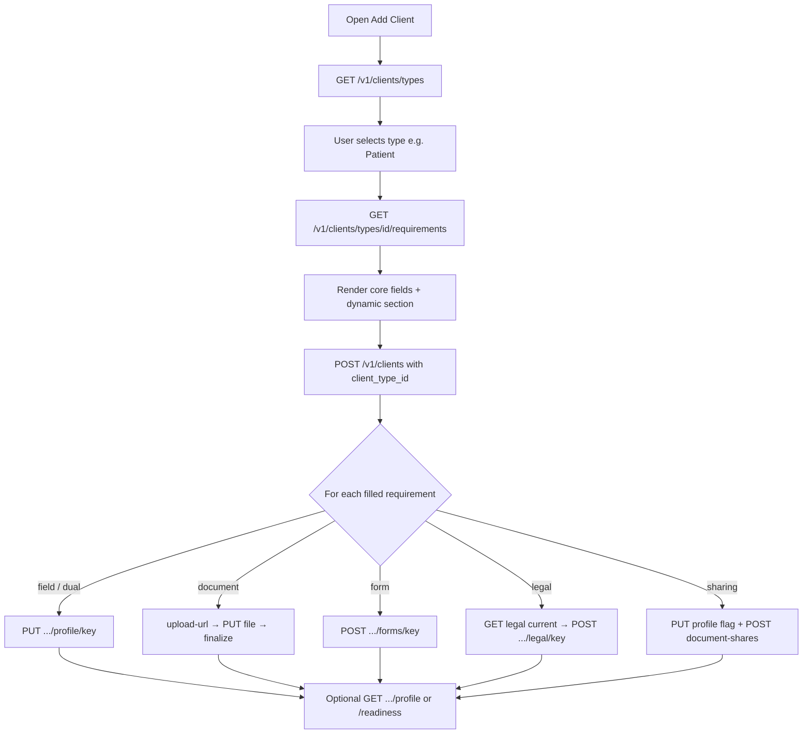

# Flutter Guide — Client Types & Add Client Screen

**Audience:** Flutter developers updating the **Add Client** / **Edit Client** flows  
**Status:** Backend live (migration `V020`)  
**Last updated:** 2026-08-04  
**Companion:** [Implementation summary](./client-types-profile-implementation-summary.md)

---

## 1. Goal

Stop hard-coding a “Patient” form in Flutter. Instead:

1. Load **client types** from the API.
2. When the user picks a type (e.g. Patient), load that type’s **requirements**.
3. Render fields / uploads / forms / consent **from the schema**.
4. Save core client first, then save each optional requirement using the matching endpoint.

All seeded Patient requirements are **optional** today. Do not block “Create” on empty profile fields unless product later enables hard enforcement.

---

## 2. Permissions the staff JWT needs

| Permission | Used for |
|------------|----------|
| `clients.manage` | Create / patch client |
| `clients.types.read` | List types + requirements + legal doc text |
| `clients.profile.manage` | Profile facts + intake forms |
| `clients.legal.accept` | Consent acceptance |
| `clients.docs.manage` | Upload client documents |
| `documents.upload` | Upload-url / finalize |
| `clients.docs.share` | Share docs with contractors |
| `clients.readiness.read` | Readiness banner (optional UI) |
| `clients.read` | Profile bundle / list |

If types endpoints return `403`, check role seed includes the new keys (owner/admin/supervisor after `V020` + seed).

---

## 3. Recommended screen flow



### Suggested UX structure

1. **Core section (always):** full name, email, phone, status, notes, sites/contacts as today.
2. **Client type picker** (required for dynamic section): dropdown from `/types`.
3. **Type-specific section** (appears after type selected): list requirements by `sort_order`.
4. Mark every dynamic field as optional unless `is_required == true` (Patient seed is all `false`).
5. Primary button: **Save client** → create → then save dynamic answers (show progress / partial failure).

**Important:** Create the client **before** uploads. Document upload needs `owner_id = client_id`.

---

## 4. API reference

Base path: `/v1`  
Auth: `Authorization: Bearer <access_token>`

### 4.1 List client types

```http
GET /v1/clients/types
```

**Response (array):**

```json
[
  {
    "id": "c0000001-0001-4001-8001-000000000001",
    "tenant_id": null,
    "code": "patient",
    "name": "Patient",
    "description": "...",
    "industry_code": "healthcare",
    "is_active": true,
    "sort_order": 10
  }
]
```

Use `id` as `client_type_id` on create. Prefer displaying `name`; keep `code` for analytics/logging.

---

### 4.2 Load requirements (dynamic schema)

```http
GET /v1/clients/types/{client_type_id}/requirements
```

**Each item (shape):**

| Field | Meaning for UI |
|-------|----------------|
| `requirement_key` | Stable id for save endpoints |
| `label` / `help_text` | Widget title / subtitle |
| `sort_order` | Display order |
| `kind` | `field` \| `document` \| `form` \| `legal` \| `sharing_flag` |
| `capture_modes` | Which widgets to show (`field`, `document`, …) |
| `value_type` | `text`, `textarea`, `date`, `number`, `boolean`, `select`, `multiselect` |
| `field_schema_json` | Placeholders, `accept` MIME list, form `fields`, share keys |
| `document_category` | Pass as `category` on document upload |
| `legal_doc_key` | For legal kind — fetch current wording |
| `sensitivity_class` | Optional UI badge (`restricted_health`, etc.) |
| `is_required` | Show required asterisk / validate |

**Dual capture rule:** if `capture_modes` contains both `field` and `document`, show **both** a text/date input **and** an upload control. User may fill either or both.

---

### 4.3 Create client (core + type)

```http
POST /v1/clients
Content-Type: application/json
```

```json
{
  "full_name": "Alex Patient",
  "email": "alex@example.com",
  "phone": "+61400000000",
  "status": "active",
  "service_agreement_notes": null,
  "metadata": {},
  "client_type_id": "c0000001-0001-4001-8001-000000000001",
  "dob": "1990-05-01"
}
```

| Field | Notes |
|-------|--------|
| `client_type_id` | From types list; unlocks profile requirements |
| `dob` | Optional ISO date `YYYY-MM-DD`; also mirrored to profile fact `dob` when type is set |

**Response:** `ClientOut` including `id`, `client_type_id`, `dob`.

Keep existing site/contact/invite calls unchanged after create.

**Edit client:** `PATCH /v1/clients/{id}` can update `client_type_id` and `dob` the same way.

---

### 4.4 Save field / dual-capture / sharing flag

```http
PUT /v1/clients/{client_id}/profile/{requirement_key}
Content-Type: application/json
```

**Examples:**

```json
{ "value_json": "430000000" }
```

```json
{ "value_json": "Staff summary of medical report" }
```

```json
{ "value_json": "1990-05-01" }
```

```json
{ "value_json": true }
```

```json
{ "document_id": "aaaaaaaa-bbbb-cccc-dddd-eeeeeeeeeeee" }
```

```json
{
  "value_json": "430000000",
  "document_id": "aaaaaaaa-bbbb-cccc-dddd-eeeeeeeeeeee"
}
```

Clear:

```json
{ "clear_value": true, "clear_document": true }
```

→ HTTP `204` when fully cleared.

**`value_json` typing by `value_type`:**

| `value_type` | JSON type |
|--------------|-----------|
| `text` / `textarea` / `select` | string |
| `date` | string `YYYY-MM-DD` |
| `number` | number |
| `boolean` | boolean |
| `multiselect` | string array |

---

### 4.5 Upload a document (photo, ID, dual-capture files)

Reuse existing document APIs.

```http
POST /v1/documents/upload-url
```

```json
{
  "owner_type": "client",
  "owner_id": "<client_id>",
  "filename": "medicare-card.jpg",
  "content_type": "image/jpeg",
  "size_bytes": 123456,
  "category": "medicare_card"
}
```

`category` **must** match the requirement’s `document_category` (e.g. `client_photo`, `medical_report`, `ndis`, `identity_100_point`).

Then:

1. `PUT` bytes to returned `upload_url`
2. `POST /v1/documents/{document_id}/finalize`

For **dual capture**, optionally also:

```http
PUT /v1/clients/{client_id}/profile/{requirement_key}
{ "document_id": "<document_id>" }
```

For **document-only** requirements (`photo`, `identity_100_point`), uploading with the correct `category` is enough for readiness; linking via profile PUT is still useful for “current document” UX.

Respect `field_schema_json.accept` (MIME types) and `max_files` when present.

Staff needs `clients.docs.manage` + `documents.upload`.

---

### 4.6 Intake form (`kind: form`)

Schema lives on the requirement as `field_schema_json.fields` (same shape as visit form templates: `id`, `type`, `label`, `required`).

```http
POST /v1/clients/{client_id}/forms/intake_form
```

```json
{
  "status": "submitted",
  "payload_json": {
    "preferred_name": "Alex",
    "emergency_contact_name": "Sam",
    "emergency_contact_phone": "+61411111111",
    "support_goals": "Community access",
    "allergies": "None known"
  }
}
```

Keys in `payload_json` = field `id`s from the schema. Render with your existing dynamic form widgets if you already have them for visit forms.

---

### 4.7 Consent (`kind: legal`)

1. Read `legal_doc_key` from the requirement (Patient: `patient.consent_agreement`).

```http
GET /v1/clients/legal-documents/patient.consent_agreement/current
```

Show `title` + `content_md` (markdown). Note `counsel_pending` if you want a soft warning in debug/admin builds.

2. Record staff-assisted acceptance:

```http
POST /v1/clients/{client_id}/legal/consent_agreement
```

```json
{
  "event_type": "consented",
  "legal_document_version_id": "<from current>",
  "participant_or_rep_name": "Alex Patient",
  "relationship": "self",
  "method": "staff_recorded",
  "signed_at": "2026-08-04T12:00:00Z",
  "note": null
}
```

`method`: `wet_ink_sighted` | `verbal` | `uploaded_scan` | `staff_recorded`  
For `accepted` / `consented`, **name + method are required** (`attestation_required` otherwise).

---

### 4.8 Share medical report (`kind: sharing_flag`)

Patient requirement `share_medical_report`:

1. Toggle intent:

```http
PUT /v1/clients/{client_id}/profile/share_medical_report
{ "value_json": true }
```

2. Grant a contractor (requires active engagement):

```http
POST /v1/clients/{client_id}/document-shares
```

```json
{
  "contractor_id": "<uuid>",
  "requirement_keys": ["medical_report"],
  "note": "Share for upcoming visits"
}
```

`requirement_keys` should match keys listed under `field_schema_json.shares_requirement_keys` (default `["medical_report"]`).

List / revoke:

- `GET /v1/clients/{client_id}/document-shares`
- `DELETE /v1/clients/{client_id}/document-shares/{share_id}`

On Add Client, you may defer sharing to an **Edit Client → Sharing** subsection (needs a contractor picker).

---

### 4.9 Load everything for Edit Client

```http
GET /v1/clients/{client_id}/profile
```

Returns:

- `client_type`
- `requirements` (schema to re-render)
- `facts`, `form_submissions`, `legal_acceptances`, `document_shares`
- `readiness`

Prefer this single call on edit instead of stitching many GETs.

Optional:

```http
GET /v1/clients/{client_id}/readiness
```

Use for a checklist / progress bar. With default `all_soft`, `blocked` is usually `false`.

---

## 5. Widget mapping cheat sheet

| `kind` + `capture_modes` | Flutter UI |
|--------------------------|------------|
| `field` only | Text / date / switch from `value_type` |
| `field` + `document` | Text **and** file picker (dual) |
| `document` only | File picker (multi if `max_files` > 1) |
| `form` | Nested dynamic form from `field_schema_json.fields` |
| `legal` | Markdown viewer + attestation fields + Confirm |
| `sharing_flag` | Switch; if on, contractor multi-select + grant |

Do **not** switch on `requirement_key` strings for layout if you can avoid it—new industries will add keys without an app release. Special-case only when UX truly needs it (e.g. sharing needs a contractor list).

---

## 6. Suggested Dart models (sketch)

```dart
class ClientType {
  final String id;
  final String code;
  final String name;
  // ...
}

class ClientTypeRequirement {
  final String requirementKey;
  final String label;
  final String? helpText;
  final int sortOrder;
  final String kind; // field|document|form|legal|sharing_flag
  final List<String> captureModes;
  final String? valueType;
  final Map<String, dynamic> fieldSchemaJson;
  final String? documentCategory;
  final String? legalDocKey;
  final bool isRequired;
}

class ProfileFactUpsert {
  final Object? valueJson;
  final String? documentId;
  final bool clearValue;
  final bool clearDocument;
}
```

Parse `requirements` into a list and `map((r) => RequirementEditor(requirement: r))`.

---

## 7. Save orchestration (pseudo)

```dart
Future<void> saveAddClient(AddClientDraft draft) async {
  final client = await api.createClient(CreateClientRequest(
    fullName: draft.fullName,
    email: draft.email,
    phone: draft.phone,
    clientTypeId: draft.clientTypeId,
    dob: draft.dob, // if captured in core or from dob requirement
  ));

  for (final answer in draft.answers) {
    final req = answer.requirement;
    try {
      if (req.captureModes.contains('field') ||
          req.captureModes.contains('sharing_flag')) {
        if (answer.valueJson != null) {
          await api.upsertProfileFact(client.id, req.requirementKey, value: answer.valueJson);
        }
      }
      if (req.captureModes.contains('document') && answer.localFile != null) {
        final docId = await api.uploadClientDocument(
          clientId: client.id,
          category: req.documentCategory!,
          file: answer.localFile!,
        );
        if (req.captureModes.contains('field')) {
          await api.upsertProfileFact(client.id, req.requirementKey, documentId: docId);
        }
      }
      if (req.kind == 'form' && answer.formPayload != null) {
        await api.submitClientForm(client.id, req.requirementKey, answer.formPayload!);
      }
      if (req.kind == 'legal' && answer.legalAccepted) {
        await api.acceptClientLegal(client.id, req.requirementKey, answer.attestation!);
      }
      // sharing grants: after toggle, when contractorIds known
    } catch (e) {
      // Collect partial errors; client already exists — show “finish profile” toast
    }
  }
}
```

---

## 8. Error codes to handle

| Code / detail | When | UI |
|---------------|------|-----|
| `client_type_not_found` | Bad / inactive type | Refresh types list |
| `requirement_not_found` | Key not on this type | Rebuild requirements |
| `document_category_mismatch` | Upload category ≠ requirement | Fix `category` |
| `document_must_belong_to_client` | Wrong `owner_id` | Use new client id |
| `attestation_required` | Consent without name/method | Highlight attestation |
| `legal_version_unavailable` | No current legal text | Show error / contact support |
| `contractor_not_engaged` | Share without active engagement | Pick engaged contractor |
| `client_onboarding_legal_incomplete` | Job create blocked (hard mode) | Open readiness checklist |
| `402 subscription_expired` | Trial ended | Existing billing redirect |

---

## 9. Patient seed — quick UI checklist

| Label | Key | UI |
|-------|-----|-----|
| Date of birth | `dob` | Date picker (also send on `POST /clients` as `dob`) |
| NDIS | `ndis` | Text + upload |
| Photo | `photo` | Image upload (`client_photo`) |
| 100-point ID | `identity_100_point` | Multi-file upload |
| Consent | `consent_agreement` | Markdown + attestation |
| Medicare | `medicare_card` | Text + upload |
| Intake form | `intake_form` | Nested form |
| Medical report | `medical_report` | Textarea + upload |
| Concession | `concession_card` | Text + upload |
| Share medical report | `share_medical_report` | Switch (+ share sheet later) |
| Diagnoses | `diagnoses` | Textarea + upload |
| Behaviour diagnoses | `behaviour_diagnoses` | Textarea + upload |

---

## 10. Edit Client screen

1. `GET /v1/clients/{id}` — core fields  
2. `GET /v1/clients/{id}/profile` — type, requirements, existing answers  
3. Prefill widgets from `facts` / forms / legal / shares  
4. On save: `PATCH` core, then upsert only **changed** requirements  
5. Changing `client_type_id` reloads requirements (warn that answers for old keys remain in DB but may not show)

---

## 11. Out of scope for V1 Flutter (optional later)

- Tenant admin UI to edit enforcement (`PUT /v1/clients/types/{id}/settings`)
- Building new client types in-app (catalog is seeded / DB-managed)
- Blocking Add Client submit on incomplete soft items

---

## 12. Smoke test for QA

1. Login as tenant admin.  
2. Add Client → type **Patient** → dynamic section appears with 12 items.  
3. Fill name + DOB + diagnoses text only → create succeeds.  
4. Upload medical report PDF with category `medical_report` → appears in docs list.  
5. Complete consent with attestation → acceptance returned.  
6. Open Edit Client → profile bundle shows facts + legal.  
7. Create job for client (default soft) → still allowed.

---

## Related backend files

- Routes: `timesheet-backend/app/modules/clients/router.py`
- Schemas: `profile_schemas.py`, `schemas.py` (`ClientCreate.client_type_id`)
- Migration / seed: `timesheet-db/migrations/V020__client_types_and_requirements.sql`
