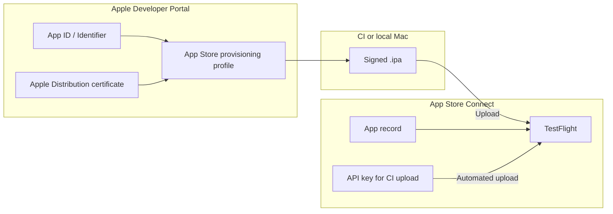
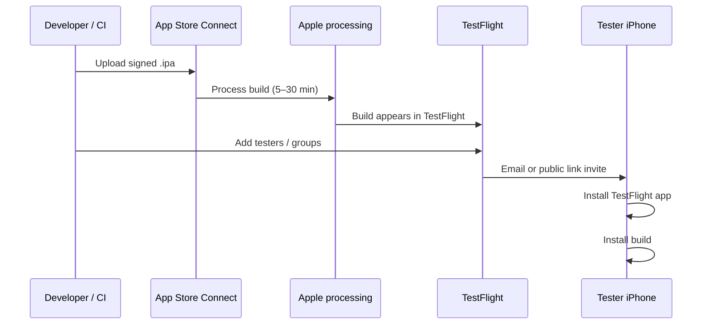

# Apple code signing and TestFlight distribution

End-to-end guide for the **Apple Developer** and **App Store Connect** side of shipping the Timesheet Flutter app to iPhones. This document covers creating signing identities and distributing builds through **TestFlight**. For wiring those assets into CI, see [ios-github-actions.md](./ios-github-actions.md) or [ios-codemagic.md](./ios-codemagic.md).

**Bundle ID used in this project:** `com.deepdownidea.timesheet` (`ios/Runner.xcodeproj/project.pbxproj`).

---

## Overview: what you need and where it goes



| Asset | Purpose | Used by |
|-------|---------|---------|
| **Apple Developer Program** membership | Legal right to sign and distribute iOS apps | Everyone |
| **Team ID** | 10-character team identifier | Xcode, CI, `ExportOptions.plist` |
| **App ID (bundle identifier)** | Unique app identity, e.g. `com.deepdownidea.timesheet` | Xcode project, profiles, App Store Connect |
| **Apple Distribution certificate** | Signs release IPAs | Local Mac or CI (as `.p12`) |
| **App Store provisioning profile** | Links cert + App ID for App Store / TestFlight builds | Xcode / `flutter build ipa` |
| **App record in App Store Connect** | Container for builds, TestFlight, and eventual App Store listing | Required before first upload |
| **App Store Connect API key** (optional) | Lets CI upload to TestFlight without a Mac login | GitHub Actions, Codemagic |

For **TestFlight**, you need: **Apple Distribution** cert + **App Store** provisioning profile + **App Store Connect app record**. You do **not** need registered device UDIDs for TestFlight (unlike Ad Hoc).

---

## Part 1 — Apple Developer Program

### Enroll

1. Go to [developer.apple.com/programs](https://developer.apple.com/programs/).
2. Enroll as an **Individual** or **Organization** ($99 USD/year).
3. Organization enrollment requires a D-U-N-S number and can take several days.

### Find your Team ID

1. Sign in to [Apple Developer → Membership details](https://developer.apple.com/account#MembershipDetailsCard).
2. Copy **Team ID** (10 characters, e.g. `AB12CD34EF`).

You will use this in export options, CI secrets (`APPLE_TEAM_ID`), and when creating API keys.

### Roles (who can do what)

| Role | Developer Portal (certs, profiles) | App Store Connect (apps, TestFlight) |
|------|-----------------------------------|--------------------------------------|
| **Account Holder** | Full | Full |
| **Admin** | Full | Full |
| **App Manager** | Limited | Create apps, manage TestFlight, upload builds |
| **Developer** | Create certs/profiles (if permitted) | Usually no App Store Connect access |

For a small team, one **Account Holder** or **Admin** usually sets up signing; **App Manager** is enough for day-to-day TestFlight if you use an API key for uploads.

---

## Part 2 — Register the App ID (identifier)

The bundle ID in Xcode must match Apple exactly.

1. Open [Certificates, Identifiers & Profiles → Identifiers](https://developer.apple.com/account/resources/identifiers/list).
2. Click **+** → **App IDs** → **App** → Continue.
3. **Description:** e.g. `Timesheet`.
4. **Bundle ID:** choose **Explicit** → `com.deepdownidea.timesheet`.
5. Under **Capabilities**, enable only what the app uses (e.g. **Push Notifications** if you add Firebase later). Unused capabilities can complicate profiles.
6. Register.

Confirm the Flutter/iOS project uses the same value:

```text
ios/Runner.xcodeproj/project.pbxproj  →  PRODUCT_BUNDLE_IDENTIFIER = com.deepdownidea.timesheet;
```

---

## Part 3 — Distribution certificate

TestFlight and App Store builds require an **Apple Distribution** certificate (not *Apple Development*).

Apple allows at most **three** active Distribution certificates per team. Revoke old or unused ones before creating a new certificate if you hit the limit.

### Step A — Create a Certificate Signing Request (CSR)

Choose **one** path below. You only need a CSR if you are creating the certificate manually on the Apple Developer website (Option 1).

#### Option 1 — Mac (Keychain Access)

1. Open **Keychain Access**.
2. Menu **Keychain Access → Certificate Assistant → Request a Certificate From a Certificate Authority**.
3. **User Email:** your Apple ID email.
4. **Common Name:** e.g. `Timesheet Distribution`.
5. **Request is:** Saved to disk.
6. Save `CertificateSigningRequest.certSigningRequest`.

Continue with [Step B](#step-b--create-the-certificate-in-apple-developer) and [Step C](#step-c--install-and-export-as-p12).

#### Option 2 — Codemagic (no Mac, no CSR file)

If you build with [Codemagic](https://codemagic.io), you can skip the CSR entirely. Codemagic creates the **Apple Distribution** certificate and private key through the App Store Connect API — no Keychain Access and no `.certSigningRequest` file.

**Prerequisite:** add an App Store Connect API key to Codemagic first (Part 6 below covers creating the key in App Store Connect; then in Codemagic go to **Team settings → Team integrations → Developer Portal → Manage keys** and upload the `.p8` file).

1. Codemagic → **Team settings** → **codemagic.yaml settings** → **Code signing identities**.
2. Open the **iOS certificates** tab.
3. Click **Generate certificate**.
4. **Reference name:** e.g. `timesheet-distribution` (used to identify the cert in Codemagic).
5. **Certificate type:** **Apple Distribution**.
6. **App Store Connect API key:** select the key you uploaded (e.g. `Timesheet CI`).
7. Click **Create certificate**.

Codemagic registers the certificate with Apple and stores the certificate + private key in your team’s code signing identities.

**Right after creation:**

- **Download the `.p12`** if Codemagic offers it — this is available **only once**. Save the export password Codemagic displays; store the file in a team password manager. You need the `.p12` only if you also plan to sign with [GitHub Actions](./ios-github-actions.md) or want an offline backup.
- If you do not download it, the certificate stays in Codemagic and is used automatically during iOS builds configured in [ios-codemagic.md](./ios-codemagic.md).
- To restore a Codemagic-created cert later, use **Fetch certificate** on the same tab (works only for certificates originally generated by Codemagic — not for certs created on a Mac).

**When using Option 2:** skip Steps B and C below. Continue with [Part 4](#part-4--provisioning-profile-app-store) — you can **Fetch profiles** from the same Codemagic **Code signing identities** page instead of downloading `.mobileprovision` files manually.

> Apple allows at most **three** active Distribution certificates per team. If **Create certificate** fails with *"You already have a current Distribution certificate"*, revoke an unused cert in [Apple Developer → Certificates](https://developer.apple.com/account/resources/certificates/list) or upload an existing `.p12` under **Upload certificate** instead.

### Step B — Create the certificate in Apple Developer

*Option 1 (Mac) only — skip if you used Codemagic Option 2.*

1. [Certificates](https://developer.apple.com/account/resources/certificates/list) → **+**.
2. Under **Software**, select **Apple Distribution** → Continue.
3. Upload the CSR → Continue → Download `distribution.cer`.

### Step C — Install and export as `.p12`

*Option 1 (Mac) only — skip if you used Codemagic Option 2.*

1. Double-click `distribution.cer` to add it to Keychain (login keychain).
2. In Keychain Access, find the certificate (often under **My Certificates** with a private key nested under it).
3. Expand the certificate; you must see a **private key** paired with it. If there is no private key, the CSR was created on a different machine — create a new CSR on this Mac and re-issue the certificate.
4. Select **both** the certificate and private key → right-click → **Export 2 items…**.
5. Format: **Personal Information Exchange (.p12)**.
6. Set a strong **export password** — you will need it for CI (`IOS_P12_PASSWORD`).

Keep the `.p12` file secure. Do not commit it to git. Back it up in a team password manager or secrets vault; if you lose the private key, you must create a new certificate.

---

## Part 4 — Provisioning profile (App Store)

A provisioning profile binds your **App ID**, **Distribution certificate**, and distribution method.

### Create an App Store profile (for TestFlight)

1. [Profiles](https://developer.apple.com/account/resources/profiles/list) → **+**.
2. Select **App Store Connect** (under Distribution) → Continue.
   - In older UI this may appear as **App Store**.
3. Select App ID **com.deepdownidea.timesheet** → Continue.
4. Select your **Apple Distribution** certificate → Continue.
5. **Provisioning Profile Name:** e.g. `Timesheet App Store` — copy this exact name for CI (`IOS_PROVISIONING_PROFILE_NAME`).
6. Generate → Download `Timesheet_App_Store.mobileprovision`.

### When to recreate the profile

Create a new profile and re-download if you:

- Change the App ID capabilities (e.g. enable Push Notifications).
- Revoke or replace the Distribution certificate.
- Change the bundle identifier.

After updating, re-upload the profile to Codemagic or refresh `IOS_PROVISIONING_PROFILE_BASE64` in GitHub.

### Ad Hoc profile (optional — not for TestFlight)

Use **Ad Hoc** only if you install IPAs directly on specific devices without TestFlight. You must register each device **UDID** under [Devices](https://developer.apple.com/account/resources/devices/list) before creating the profile.

---

## Part 5 — App Store Connect app record

Before the first IPA upload, create the app in App Store Connect with the **same bundle ID** as the Developer Portal.

1. Sign in to [App Store Connect](https://appstoreconnect.apple.com).
2. **Apps** → **+** → **New App**.
3. **Platforms:** iOS.
4. **Name:** display name (e.g. `Timesheet`). This is what users see; it can differ from the Xcode product name.
5. **Primary Language:** your choice.
6. **Bundle ID:** select `com.deepdownidea.timesheet` from the dropdown (only appears after Part 2).
7. **SKU:** internal string, e.g. `timesheet-ios-001` (not shown to users).
8. **User Access:** Full Access (typical for your own app).

You do not need a complete App Store listing to use TestFlight. You do need minimal metadata before **external** testing (see Part 7).

---

## Part 6 — App Store Connect API key (for CI uploads)

CI systems upload IPAs to TestFlight using an **API key**, not your Apple ID password.

### Create the key

1. App Store Connect → **Users and Access** → **Integrations** → **App Store Connect API**.
2. **+** to generate a key.
3. **Name:** e.g. `Timesheet CI`.
4. **Access:** **App Manager** (minimum for upload and TestFlight).
5. **Generate** → **Download** the `.p8` file **once** (Apple does not let you download it again).

Record three values:

| Value | Where to find it |
|-------|------------------|
| **Issuer ID** | Top of the App Store Connect API page |
| **Key ID** | Column in the keys table (10 characters) |
| **Private key** | Contents of the downloaded `AuthKey_XXXXXXXXXX.p8` file |

### Map to CI secrets

**GitHub Actions** ([ios-github-actions.md](./ios-github-actions.md)):

| Secret | Value |
|--------|-------|
| `APP_STORE_CONNECT_ISSUER_ID` | Issuer ID |
| `APP_STORE_CONNECT_KEY_ID` | Key ID |
| `APP_STORE_CONNECT_PRIVATE_KEY` | Full `.p8` file contents |

**Codemagic:** Team integrations → App Store Connect → upload the same key.

You can still upload manually from Xcode or **Transporter** without an API key.

---

## Part 7 — TestFlight distribution

### How a build reaches testers



### Upload methods

| Method | When to use |
|--------|-------------|
| **CI** (GitHub Actions `upload_testflight: true`, Codemagic `submit_to_testflight: true`) | Every release from `ios` branch or tags |
| **Transporter** (Mac App Store) | Manual upload of `.ipa` from a local or CI artifact |
| **Xcode → Organizer → Distribute App** | Local archive from Xcode |

After upload, open App Store Connect → your app → **TestFlight**. The build shows **Processing** until Apple finishes; failed compliance or missing export rules block testing.

### First-build checklist (App Store Connect)

After the first successful upload, you may need to complete in App Store Connect:

1. **Export compliance** — For apps that only use standard HTTPS (like this API client), answer **No** to encryption beyond exempt categories, or follow Apple’s questionnaire.
2. **Test information** — Beta app description and contact email (required for external testing).
3. **App Privacy** — Privacy nutrition labels if you move toward public TestFlight or App Store review.

### Internal testing (fastest)

- **Who:** Up to 100 users with App Store Connect roles on your team (Admin, App Manager, Developer, etc.).
- **Review:** No Apple beta review; builds are available minutes after processing.
- **Setup:**
  1. TestFlight → **Internal Testing** → default group or **+** new group.
  2. Add builds to the group.
  3. Add internal testers by App Store Connect user (they must accept the email invite).

Best for your own devices and immediate colleagues who already have ASC access.

### External testing (wider audience)

- **Who:** Up to 10,000 testers by email or public link.
- **Review:** First build (and sometimes significant updates) require **Beta App Review** (usually 24–48 hours).
- **Setup:**
  1. TestFlight → **External Testing** → **+** group.
  2. Add the build; fill **What to Test** notes.
  3. Add testers by email or enable **Public Link**.
  4. Submit for beta review if prompted.

Testers install Apple’s free **TestFlight** app from the App Store, accept your invite, then install your build.

### Tester experience

1. Receive email invite or open public link.
2. Install **TestFlight** from the App Store (if needed).
3. Accept invite → **Install** next to your app.
4. Open the app from TestFlight or the home screen.
5. Builds expire after **90 days**; upload a newer build before expiry.

---

## Part 8 — Prepare artifacts for your CI pipeline

Once Apple-side assets exist, export them for [ios-github-actions.md](./ios-github-actions.md) or [ios-codemagic.md](./ios-codemagic.md).

### Files and secrets checklist

| Item | Format | GitHub secret / variable | Codemagic |
|------|--------|--------------------------|-----------|
| Distribution cert + private key | `.p12` + password | `IOS_P12_BASE64`, `IOS_P12_PASSWORD` | iOS certificates tab |
| App Store provisioning profile | `.mobileprovision` | `IOS_PROVISIONING_PROFILE_BASE64` | iOS provisioning profiles tab |
| Team ID | string | `APPLE_TEAM_ID` | Env var or `ios_signing` |
| Bundle ID | string | `IOS_BUNDLE_ID` | `IOS_BUNDLE_ID` / `bundle_identifier` |
| Profile display name | string | `IOS_PROVISIONING_PROFILE_NAME` | Auto-matched by bundle ID |
| API key | `.p8` + IDs | `APP_STORE_CONNECT_*` | App Store Connect integration |

### Base64-encode for GitHub (from your machine)

```bash
# macOS
base64 -i Certificates.p12 | pbcopy
base64 -i Timesheet_App_Store.mobileprovision | pbcopy

# Linux
base64 -w0 Certificates.p12
base64 -w0 Timesheet_App_Store.mobileprovision
```

### What CI builds

A signed release IPA is produced with:

```bash
flutter build ipa --release \
  --dart-define=API_BASE_URL=https://timesheetbackend.deepdownidea.com \
  --export-options-plist=ios/ExportOptions.plist
```

For TestFlight, `ExportOptions.plist` must use `method` = `app-store` (GitHub Actions: `distribution_method: app-store`).

---

## Part 9 — Ongoing maintenance

| Event | Action |
|-------|--------|
| **Distribution certificate expires** (typically 1 year) | Create new cert, new profile, update CI secrets |
| **New tester device (Ad Hoc only)** | Register UDID, regenerate Ad Hoc profile |
| **Bundle ID change** | New App ID, new profile, new App Store Connect app |
| **Enable Push / Sign in with Apple** | Update App ID capabilities, regenerate profile |
| **CI upload fails with auth error** | Rotate App Store Connect API key; update secrets |
| **“Missing compliance” in TestFlight** | Complete export compliance in App Store Connect |

---

## Troubleshooting

| Symptom | Likely cause | Fix |
|---------|--------------|-----|
| `No profiles for 'com.deepdownidea.timesheet' were found` | No App Store profile or wrong bundle ID | Create App Store profile; match `IOS_BUNDLE_ID` |
| `No signing certificate "iOS Distribution" found` | Wrong cert type or `.p12` without private key | Use **Apple Distribution**; re-export `.p12` with private key |
| `Provisioning profile doesn't match` | Profile for different App ID or expired cert | Regenerate profile after cert or capability changes |
| Upload succeeds but build never appears | Still processing or invalid binary | Wait 30 min; check email from Apple for errors |
| TestFlight: “Missing Compliance” | Export compliance not answered | App → TestFlight → build → Manage compliance |
| External testers can’t install | Beta review pending or build not added to external group | Submit for review; add build to external group |
| `You already have a current Distribution certificate` | 3 cert limit | Revoke unused certs in Developer Portal |
| API upload: `Authentication credentials are missing or invalid` | Wrong Issuer ID, Key ID, or `.p8` | Re-copy secrets; ensure `.p8` includes `BEGIN/END` lines |

---

## Quick reference links

| Resource | URL |
|----------|-----|
| Apple Developer Program | [developer.apple.com/programs](https://developer.apple.com/programs/) |
| Identifiers (App IDs) | [developer.apple.com/account/resources/identifiers/list](https://developer.apple.com/account/resources/identifiers/list) |
| Certificates | [developer.apple.com/account/resources/certificates/list](https://developer.apple.com/account/resources/certificates/list) |
| Provisioning profiles | [developer.apple.com/account/resources/profiles/list](https://developer.apple.com/account/resources/profiles/list) |
| Devices (Ad Hoc) | [developer.apple.com/account/resources/devices/list](https://developer.apple.com/account/resources/devices/list) |
| App Store Connect | [appstoreconnect.apple.com](https://appstoreconnect.apple.com) |
| App Store Connect API | [appstoreconnect.apple.com/access/integrations/api](https://appstoreconnect.apple.com/access/integrations/api) |
| Transporter (Mac) | [apps.apple.com/app/transporter/id1450874784](https://apps.apple.com/app/transporter/id1450874784) |
| TestFlight for testers | [apps.apple.com/app/testflight/id899247664](https://apps.apple.com/app/testflight/id899247664) |

---

## Related docs

- [ios-github-actions.md](./ios-github-actions.md) — GitHub Actions workflow and secret names
- [ios-codemagic.md](./ios-codemagic.md) — Codemagic setup and `ios` branch CI
- [flutter-commands.md](./flutter-commands.md) — Local Flutter build commands
