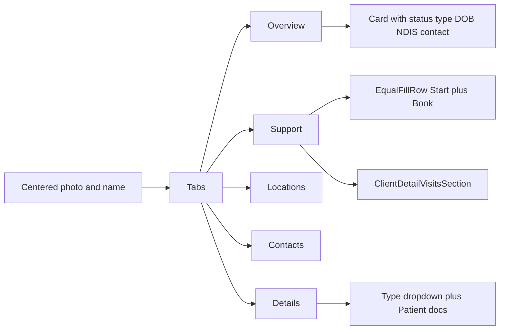

# Trial UX Tweaks Implementation Plan

> **For agentic workers:** REQUIRED SUB-SKILL: Use superpowers:subagent-driven-development (recommended) or superpowers:executing-plans to implement this plan task-by-task. Steps use checkbox (`- [ ]`) syntax for tracking.
>
> **Before product code:** save this plan to [frontend/docs/superpowers/plans/2026-08-19-trial-ux-tweaks.md](frontend/docs/superpowers/plans/2026-08-19-trial-ux-tweaks.md) and finish `/gstack-plan-eng-review`. Do not start feature commits until that review is done.

**Goal:** Ship the user-facing tweaks in [TODOS.yaml](TODOS.yaml) so trial staff can log in, manage clients, review workforce, filter roster, and create payment batches without the current dead-ends and clutter.

**Architecture:** Frontend-first vertical slices on existing Flutter screens. One shared layout helper (`EqualFillRow`) plus a `MaxWidthBox` default-alignment fix. Workforce add/remove certificates and ended-engagement rate blocking get small backend authz endpoints; everything else reuses current APIs (client profile-photo GET, document pipeline, payment batch create). Client card tabs become Overview, Support, Locations, Contacts, Details (product call locked 2026-08-19).

**Tech Stack:** Flutter/GetX (`frontend/`), FastAPI/asyncpg (`backend/timesheet-backend/`), existing `PageContent` / `ProfilePhotoEditor` / `DocumentPipeline` / `FilterChip` patterns.

---

## Scope (what this plan covers)

From [TODOS.yaml](TODOS.yaml) only:

- Wide-screen centering + equal LTR row fill (helper, applied to listed screens; roster **board** stays full-bleed)
- Login form centered; visible path to contractor register and provider signup
- Workforce: after withdraw, no Review credentials / New payment rate; add/remove required certificates; reject empty certificate error; hide evidence **View** for non-reviewers
- Clients list avatars; New client hide Status (default Active); uploaded docs downloadable
- Client card: centered photo; Overview card with birthdate; tabs Overview → Support → Locations → Contacts → Details; Patient type + docs auto-shown; visits live on Support; Start ongoing + Book one session on one row; Add location form in a Card
- Roster: Client + Status on one row
- Payments: title "Create Payment Batch"; from/to range picker; completed-visit error visible on Create

**NOT in this plan** (in [TODOS.md](TODOS.md) but not YAML): roster stale-board (T7), pin dates (T9), immediate shift after create (T10), unified support stepper (T12), address autocomplete, horizon TZ/cron.

---

## File structure

New units (SRP named):

- `EqualFillRow` — [frontend/lib/core/responsive/equal_fill_row.dart](frontend/lib/core/responsive/equal_fill_row.dart) — N children → N equal `Expanded` slots. Seam: `List<Widget> children`.
- `replace_required_doc_categories` — [backend/timesheet-backend/app/modules/engagements/service.py](backend/timesheet-backend/app/modules/engagements/service.py) — tenant-scoped replace of `engagement_required_doc_categories`. Seam: PUT body `{categories: [...]}`.

Reuse (DRY — do not rebuild):

- `PageContent` / `MaxWidthBox` for centering
- Workforce list photo map (`photosByContractor` + `_ensureListPhotosLoaded`) copied for clients
- Invite `FilterChip` category picker for workforce required docs
- `DocumentPipeline.openDocument` for client doc download
- Flutter `showDateRangePicker` for pay period (no custom calendar)
- Existing `POST /v1/payments/batches` + `status: completed` visit list

---

## Design principles (where they apply)

- **DRY:** `EqualFillRow` used by roster filters and Support CTAs. Client list avatars copy workforce photo loading, not a new list DTO. Category chips copy invite UI. Document open uses `DocumentPipeline`.
- **SOLID:** `EqualFillRow` only lays out; tabs stay in `ClientDetailView`; required-doc replace is one service function; payroll only adds a status check inside `_ensure_engagement`.
- **YAGNI:** No app-wide form retrofit. No photo URL on `GET /v1/clients`. No payment `from`/`to` API fields (still `period_label`). Roster grid stays 150px day columns. Locations stays a tab (not nested in Overview).

---

## Security (trust boundary)

Crosses a trust boundary: **new PUT** for required-doc categories; **payroll create** currently ignores `ended`; evidence **View** is a data-access control.

Threats → tasks:

- IDOR / cross-tenant: `engagement_id` + `tenant_id` in SQL (same as `end_engagement`)
- Authz: `contractors.manage` (same as end/suspend)
- Ended/withdrawn: 409 `invalid_engagement_state`; UI hides actions when `isEnded`
- Empty / unknown categories: 400; reuse `CREDENTIAL_TYPES` validator from invite schema
- Evidence View: `showView: canReview` (`credentials.review`); Download stays for `credentials.read`
- Rates on ended: `_ensure_engagement` rejects `status == 'ended'`

Login links and layout helpers cross **no** new trust boundary.

---

## Slice 0 — Layout helper

### Task 1: `EqualFillRow` + center `MaxWidthBox`

**Files:**
- Create: `frontend/lib/core/responsive/equal_fill_row.dart`
- Modify: [frontend/lib/core/responsive/max_width_box.dart](frontend/lib/core/responsive/max_width_box.dart) (default `alignment` `topLeft` → `topCenter`)
- Test: `frontend/test/core/responsive/equal_fill_row_test.dart`
- Modify: [frontend/test/core/responsive/responsive_qa_test.dart](frontend/test/core/responsive/responsive_qa_test.dart) if alignment assertions exist

- [ ] **Step 1: Write the failing test**

```dart
testWidgets('one child fills max width; two children split 50/50', (tester) async {
  await tester.binding.setSurfaceSize(const Size(400, 200));
  await tester.pumpWidget(const MaterialApp(
    home: SizedBox(
      width: 400,
      child: EqualFillRow(
        children: [
          SizedBox(key: Key('a'), height: 10),
          SizedBox(key: Key('b'), height: 10),
        ],
      ),
    ),
  ));
  expect(tester.getSize(find.byKey(const Key('a'))).width, 196); // 400 - 8 spacing / 2
  expect(tester.getSize(find.byKey(const Key('b'))).width, 196);
});

testWidgets('single child uses full width', (tester) async {
  await tester.binding.setSurfaceSize(const Size(400, 200));
  await tester.pumpWidget(const MaterialApp(
    home: SizedBox(
      width: 400,
      child: EqualFillRow(children: [SizedBox(key: Key('only'), height: 10)]),
    ),
  ));
  expect(tester.getSize(find.byKey(const Key('only'))).width, 400);
});
```

- [ ] **Step 2:** `cd frontend && flutter test test/core/responsive/equal_fill_row_test.dart -v` — FAIL (`EqualFillRow` missing)

- [ ] **Step 3: Implement**

```dart
class EqualFillRow extends StatelessWidget {
  const EqualFillRow({super.key, required this.children, this.spacing = 8});
  final List<Widget> children;
  final double spacing;

  @override
  Widget build(BuildContext context) {
    if (children.isEmpty) return const SizedBox.shrink();
    return Row(
      children: [
        for (var i = 0; i < children.length; i++) ...[
          if (i > 0) SizedBox(width: spacing),
          Expanded(child: children[i]),
        ],
      ],
    );
  }
}
```

Change `MaxWidthBox` default `alignment` to `Alignment.topCenter`. Login/gateway/register then center on wide screens without per-screen patches.

- [ ] **Step 4:** tests PASS
- [ ] **Step 5:** `git commit -m "fix: center capped content and add equal-fill row helper"`

---

## Slice 1 — Login

### Task 2: Sign-up path from login

**Files:**
- Modify: [frontend/lib/app/views/login_view.dart](frontend/lib/app/views/login_view.dart) (after the card, ~L182)
- Test: `frontend/test/app/login_view_test.dart` (new)

- [ ] **Step 1: Failing widget test** — pump `LoginView` with a stub `AuthController` (same GetX/mocktail pattern as [frontend/test/features/clients/client_detail_view_tabs_test.dart](frontend/test/features/clients/client_detail_view_tabs_test.dart)). Expect `Register as contractor` and `Provider signup`.

- [ ] **Step 2:** FAIL — texts missing

- [ ] **Step 3:** After the login card:

```dart
TextButton(
  onPressed: () => Get.toNamed(AppRoutes.contractorRegister),
  child: const Text('Register as contractor'),
),
TextButton(
  onPressed: () => openExternalUrl(AppEnv.landingUrl),
  child: const Text('Provider signup'),
),
```

Reuse [frontend/lib/shared/utils/external_url.dart](frontend/lib/shared/utils/external_url.dart) and `AppEnv.landingUrl` (same as [gateway_controller.dart](frontend/lib/app/controllers/gateway_controller.dart) L39–40). Do not add a new public API.

- [ ] **Step 4–5:** PASS + commit `feat: add register links on login`

---

## Slice 2 — Workforce (API then UI)

### Task 3: PUT required-doc categories (authz)

**Files:**
- Modify: [backend/timesheet-backend/app/modules/engagements/schemas.py](backend/timesheet-backend/app/modules/engagements/schemas.py) — add `EngagementRequiredCategoriesUpdate` with the same `CREDENTIAL_TYPES` cleaner as invite
- Modify: [backend/timesheet-backend/app/modules/engagements/service.py](backend/timesheet-backend/app/modules/engagements/service.py) — `replace_required_doc_categories`
- Modify: [backend/timesheet-backend/app/modules/engagements/router.py](backend/timesheet-backend/app/modules/engagements/router.py)
- Modify: [frontend/lib/core/constants/api_paths.dart](frontend/lib/core/constants/api_paths.dart)
- Test: `backend/timesheet-backend/tests/engagements/test_required_doc_categories.py`

Route: `PUT /v1/engagements/{engagement_id}/required-doc-categories`  
Permission: `contractors.manage`  
Body: `{ "categories": ["police_check", "wwcc"] }`  
Rules: at least one category; all in `CREDENTIAL_TYPES`; engagement must exist in tenant; status must **not** be `ended` → 409 `invalid_engagement_state`.

```python
async def replace_required_doc_categories(conn, *, engagement_id, tenant_id, actor_user_id, categories: list[str]) -> EngagementOut:
    row = await conn.fetchrow(
        "SELECT id, status FROM workforce.contractor_engagements WHERE id=$1 AND tenant_id=$2 FOR UPDATE",
        engagement_id, tenant_id,
    )
    if row is None:
        raise HTTPException(404, "Engagement not found")
    if row["status"] == "ended":
        raise HTTPException(409, "invalid_engagement_state")
    await conn.execute("DELETE FROM workforce.engagement_required_doc_categories WHERE engagement_id=$1", engagement_id)
    for category in categories:
        await conn.execute(
            """INSERT INTO workforce.engagement_required_doc_categories (engagement_id, category, is_required)
               VALUES ($1, $2, true)""",
            engagement_id, category,
        )
    # domain_audit engagement_required_docs_updated
    return await _row_to_out(conn, await _get_engagement_row(...))
```

Negative tests (required):

- other tenant's engagement id → 404
- missing `contractors.manage` → 403
- `ended` engagement → 409
- empty list / unknown code → 422/400
- happy path replace add+remove, GET engagement shows new set

- [ ] Commit `feat: replace engagement required document categories`

### Task 4: Block rates on ended engagements

**Files:**
- Modify: [backend/timesheet-backend/app/modules/payroll/service.py](backend/timesheet-backend/app/modules/payroll/service.py) `_ensure_engagement` — `SELECT id, status`; if `ended` raise 409 `invalid_engagement_state`
- Test: extend [backend/timesheet-backend/tests/payments/test_visit_payment_batch.py](backend/timesheet-backend/tests/payments/test_visit_payment_batch.py) or a focused payroll test: create rate after `POST .../end` → 409

- [ ] Commit `fix: reject new payment rates on ended engagements`

### Task 5: Workforce detail UI

**Files:**
- Modify: [frontend/lib/features/engagements/views/workforce_detail_view.dart](frontend/lib/features/engagements/views/workforce_detail_view.dart)
- Modify: [frontend/lib/features/payroll/widgets/engagement_rate_bands_section.dart](frontend/lib/features/payroll/widgets/engagement_rate_bands_section.dart) — add `readOnly` (or `canEditRates`)
- Modify: [frontend/lib/features/engagements/controllers/workforce_controller.dart](frontend/lib/features/engagements/controllers/workforce_controller.dart) — `updateRequiredCategories`, reuse `inviteCategoryChoices` / `toggleCategory`
- Modify: datasource/repository + `ApiPaths.engagementRequiredDocCategories(id)`
- Modify: [frontend/lib/core/errors/app_failure.dart](frontend/lib/core/errors/app_failure.dart) — map `invalid_engagement_state` → `This worker is no longer in your workforce.`
- Test: `frontend/test/features/engagements/workforce_detail_ended_test.dart`

When `current.isEnded`:

- Hide Review credentials
- Pass `canEditRates: false` so "New payment rate" is hidden (existing bands still listed)
- Required docs stay read-only text

When `canManage && !current.isEnded`: replace the joined-label row with the invite `FilterChip` wrap + Save. Disable chips while saving.

`openCredentialReview` must no-op (or snackbar) if `isEnded`.

- [ ] Commit `fix: hide workforce review and rates after withdraw`

### Task 6: Reject empty certificate + hide View for non-reviewers

**Files:**
- Modify: [frontend/lib/features/credentials/widgets/evidence_document_actions.dart](frontend/lib/features/credentials/widgets/evidence_document_actions.dart) — `showView` default `true`
- Modify: [frontend/lib/features/credentials/views/staff_credential_review_view.dart](frontend/lib/features/credentials/views/staff_credential_review_view.dart)
- Modify: [frontend/lib/features/credentials/controllers/staff_credential_review_controller.dart](frontend/lib/features/credentials/controllers/staff_credential_review_controller.dart)
- Test: [frontend/test/features/credentials/staff_credential_review_view_test.dart](frontend/test/features/credentials/staff_credential_review_view_test.dart), [frontend/test/features/credentials/credential_review_actions_test.dart](frontend/test/features/credentials/credential_review_actions_test.dart)

Empty certificate = `evidencePresence != 'present'` **or** `evidenceFor(c).isEmpty`. On Reject:

```dart
if (controller.evidenceFor(c).isEmpty) {
  controller.errorMessage.value =
      'No certificate has been submitted to reject.';
  return;
}
controller.prepareReview(credential: c, decision: 'rejected');
```

Staff review passes `showView: controller.canReview`. Contractor credential screens keep default `showView: true`. Download always shown.

- [ ] Commit `fix: empty certificate reject copy and hide evidence view without review permission`

---

## Slice 3 — Clients

### Task 7: List avatars

**Files:**
- Modify: [frontend/lib/features/clients/controllers/clients_controller.dart](frontend/lib/features/clients/controllers/clients_controller.dart) — `photosByClient` map + `_ensureListPhotosLoaded` (copy [workforce_controller.dart](frontend/lib/features/engagements/controllers/workforce_controller.dart) L144–147 / ~450)
- Modify: [frontend/lib/features/clients/views/clients_list_view.dart](frontend/lib/features/clients/views/clients_list_view.dart) — `ListTile.leading: ProfilePhotoEditor` size 48, `readOnly: true`
- Test: `frontend/test/features/clients/clients_list_view_test.dart`

Reuse `getClientProfilePhoto` (already on repository). Background load; list renders without waiting. Missing photo = empty `ProfilePhotoEditor` circle (same as workforce).

- [ ] Commit `feat: show client avatars on the clients list`

### Task 8: New client Status + downloadable docs

**Files:**
- Modify: [frontend/lib/features/clients/views/client_form_view.dart](frontend/lib/features/clients/views/client_form_view.dart) — wrap Status dropdown in `if (!controller.isCreateFlow.value)`
- Modify: [frontend/lib/features/clients/controllers/requirement_draft.dart](frontend/lib/features/clients/controllers/requirement_draft.dart) — `existingDocumentFilename`
- Modify: [frontend/lib/features/clients/widgets/client_requirement_editors.dart](frontend/lib/features/clients/widgets/client_requirement_editors.dart) `_DocumentPicker`
- Modify: [frontend/lib/features/clients/controllers/clients_controller.dart](frontend/lib/features/clients/controllers/clients_controller.dart) — `openExistingRequirementDocument(draft)`
- Test: widget test on form create vs edit; editor test for Download when `existingDocumentId` set

`applyFact` already sets `existingDocumentId`. Also set filename from fact if present; else `'Current document on file'`. Download:

```dart
Future<void> openExistingRequirementDocument(RequirementDraft draft) async {
  final id = draft.existingDocumentId.value;
  if (id == null || _pipeline == null) return;
  await _pipeline!.openDocument(id);
}
```

Create still POSTs `status: 'active'` from `controller.status` default. Do not send a Status control.

- [ ] Commit `fix: hide status on new client and make uploaded documents downloadable`

### Task 9: Client card tabs, Overview card, Support+visits

Locked tab order:

```
tabOverview = 0
tabSupport = 1
tabLocations = 2  // was Sites
tabContacts = 3
tabDetails = 4
```



**Files:**
- Modify: [frontend/lib/features/clients/views/client_detail_view.dart](frontend/lib/features/clients/views/client_detail_view.dart) — labels, header `Column` + `Center` photo 72 + name; delete Visits chip
- Modify: [frontend/lib/features/clients/controllers/clients_controller.dart](frontend/lib/features/clients/controllers/clients_controller.dart) — new indices; `openDetail` default `tabOverview`; after create still land Overview
- Modify: [frontend/lib/features/clients/widgets/client_detail_facts_section.dart](frontend/lib/features/clients/widgets/client_detail_facts_section.dart) — wrap in `Card`; always show Date of birth (`facts.dob ?? '—'`); drop the inner "Overview" heading (tab is the name)
- Modify: [frontend/lib/features/clients/widgets/client_detail_support_section.dart](frontend/lib/features/clients/widgets/client_detail_support_section.dart) — `EqualFillRow` for Start + Book when both visible; then visits widget
- Modify: [frontend/lib/features/clients/widgets/client_detail_sites_section.dart](frontend/lib/features/clients/widgets/client_detail_sites_section.dart) — empty copy "No locations yet."; add button "Add location"
- Modify: [frontend/lib/features/clients/views/client_site_form_view.dart](frontend/lib/features/clients/views/client_site_form_view.dart) — AppBar Add/Edit location; wrap fields in `Card`
- Modify: `loadTypeTabForSelected` — if `client.clientTypeId` is null, set Patient via existing `_resolveDefaultPatientTypeId()` and load requirements so Details shows docs without a manual type pick
- Modify tests: [frontend/test/features/clients/client_detail_view_tabs_test.dart](frontend/test/features/clients/client_detail_view_tabs_test.dart), [frontend/test/features/clients/client_detail_support_section_test.dart](frontend/test/features/clients/client_detail_support_section_test.dart)

Support tab content:

```dart
Column(
  children: [
    ClientDetailSupportSection(...),
    const SizedBox(height: 24),
    ClientDetailVisitsSection(...),
  ],
)
```

When `canManage && !hasOngoing`: `EqualFillRow` of Start ongoing + Book one session. When ongoing exists: Book one + Open support on that row (Start hidden, unchanged).

Details tab: keep type dropdown (needed to change type) but auto-select Patient so editors render immediately.

Grep `tabDetails` / `tabSites` / `'Sites'` / `tabVisits` and update every caller (create-flow `openDetail(..., initialTab:)`).

- [ ] Commit `feat: rebuild client card tabs with overview and locations`

---

## Slice 4 — Roster

### Task 10: Client + Status on one row

**Files:**
- Modify: [frontend/lib/features/visits/views/staff_visits_board_view.dart](frontend/lib/features/visits/views/staff_visits_board_view.dart) ~196–255
- Test: [frontend/test/features/visits/staff_visits_board_view_test.dart](frontend/test/features/visits/staff_visits_board_view_test.dart)

```dart
EqualFillRow(
  children: [
    DropdownButtonFormField<String>(/* Client, isExpanded: true */),
    DropdownButtonFormField<String>(/* Status, isExpanded: true */),
  ],
),
if (controller.showSupportFilter) ...[
  const SizedBox(height: 8),
  DropdownButtonFormField<String>(/* Support, full width */),
],
```

Add `isExpanded: true` on Status (Client already has it). Support stays a second row when shown. Do **not** wrap the board in `PageContent`.

- [ ] Commit `fix: put roster client and status filters on one row`

---

## Slice 5 — Payments

### Task 11: Create Payment Batch UX

**Files:**
- Modify: [frontend/lib/features/payroll/views/staff_payments_view.dart](frontend/lib/features/payroll/views/staff_payments_view.dart) `_CreateBatchTab`
- Modify: [frontend/lib/features/payroll/controllers/staff_payments_controller.dart](frontend/lib/features/payroll/controllers/staff_payments_controller.dart)
- Modify: [frontend/lib/core/errors/app_failure.dart](frontend/lib/core/errors/app_failure.dart) — map `visit_not_completed`
- Modify: [backend/timesheet-backend/app/modules/payments/service.py](backend/timesheet-backend/app/modules/payments/service.py) — `detail="visit_not_completed"` (keep user copy in Flutter `_userMessage`)
- Test: `frontend/test/features/payroll/staff_payments_create_batch_test.dart`
- Test: [backend/timesheet-backend/tests/payments/test_visit_payment_batch.py](backend/timesheet-backend/tests/payments/test_visit_payment_batch.py) — non-completed visit → 400 `visit_not_completed`

UI:

- Heading `Create Payment Batch` above the helper paragraph
- Replace Period label `TextField` with one `ListTile`/`OutlinedButton` that calls `showDateRangePicker` (Material built-in). Display `yyyy-MM-dd → yyyy-MM-dd`. Still POST `period_label` as `'$from..$to'` (no backend date columns).
- `_loadUnpaidVisits` uses the picked range instead of hardcoded 90 days
- Duplicate `_ErrorBox` immediately above the Create button (header banner can stay)
- `createBatch`: if no completed visits selected, set `errorMessage` to `Visit must be completed to add to payment batch.` (same sentence as trial)

- [ ] Commit `feat: create payment batch title, date range, and completed-visit error`

---

## Test Plan and Verification

**Coverage target:** Every new public function and error path has a test. Widget tests for every YAML-visible control change. Backend: PUT categories (happy + 4 negatives), payroll ended 409, visit_not_completed 400. Aim ≥90% lines on `equal_fill_row.dart` and `replace_required_doc_categories`.

**Critical paths:**

- Login → Register as contractor reaches `/contractor/register`
- Withdraw invite → Review credentials and New payment rate gone; PUT categories 409
- Client list shows avatar; New client has no Status; Overview is tab 0 with DOB in a Card; Support shows visits + both CTAs in one row
- Roster Client and Status share a row at 390 and 1280 widths
- Create batch with range; Create with no completed visits shows the error next to the button

**Edge cases:**

- Ended engagement + `credentials.review` still cannot open review from UI
- `credentials.read` without `credentials.review`: Download yes, View no
- Reject credential with empty evidence: inline error, no review POST
- PUT categories empty list / unknown code rejected
- Create client still sends `status=active`
- Null DOB shows `—` on Overview
- Null `clientTypeId` on detail loads Patient docs
- Support filter still appears under the Client/Status row when a client has 2+ supports
- Date range load with no unpaid completed visits: empty list + Create shows completed-visit error

**Regression guards:**

- Invite-time category chips still work
- Workforce list avatars unchanged
- Roster Support-filter tests still pass
- Payment batch still creates drafts for completed unpaid visits
- Client create stepper still defaults Patient (`_resolveDefaultPatientTypeId`)

**Verification commands:**

- Unit Flutter: `cd frontend && flutter test test/core/responsive/equal_fill_row_test.dart test/app/login_view_test.dart test/features/engagements/ test/features/credentials/staff_credential_review_view_test.dart test/features/clients/ test/features/visits/staff_visits_board_view_test.dart test/features/payroll/staff_payments_create_batch_test.dart test/core/errors/app_failure_test.dart`
- Unit backend: `cd backend/timesheet-backend && .venv/bin/pytest tests/engagements/test_required_doc_categories.py tests/payments/test_visit_payment_batch.py -q`
- Coverage: `cd frontend && flutter test --coverage` on the files above; pytest `--cov` on the new service function
- Manual: wide desktop login centered; client card five tabs; withdrawn worker; create batch click with empty selection

**Acceptance criteria (from YAML):**

- [ ] Wide content centered; 1/2-child rows fill equally → Task 1 + 10 + 9
- [ ] Login form centered; path to signup/register → Task 1 + 2
- [ ] Withdrawn invite: no review, no new rates → Task 4 + 5
- [ ] Add/remove requested certificates → Task 3 + 5
- [ ] Reject empty certificate error → Task 6
- [ ] Non-admin no View on evidence → Task 6
- [ ] Clients list avatar → Task 7
- [ ] New client: no Status, default Active; docs downloadable → Task 8
- [ ] Overview card, centered image, DOB, Locations rename, Patient docs, tab order, visits on Support, CTAs one row, Add location card → Task 9
- [ ] Roster Client+Status one row → Task 10
- [ ] Create Payment Batch title, from/to picker, completed-visit error on Create → Task 11

---

## Self-review (write-plan)

- Spec coverage: every YAML bullet maps to a task. Empty Workforce bullet ignored. Sites → Locations per 2026-08-19 choice.
- No TBD/placeholder steps. Types (`tabOverview`, `invalid_engagement_state`, `EqualFillRow`) are consistent across tasks.
- TDD: each task starts with a failing test.
- Trust boundary: Tasks 3, 4, 6 carry negative tests.
- YAGNI: no client-list photo DTO, no payment `from`/`to` columns, no roster `PageContent`, no TODOS.md T7–T12.

---

## After this Cursor plan is accepted

1. Write the same content to [frontend/docs/superpowers/plans/2026-08-19-trial-ux-tweaks.md](frontend/docs/superpowers/plans/2026-08-19-trial-ux-tweaks.md)
2. Run `/gstack-plan-eng-review` (interactive). Fold resolutions into that file.
3. Then offer Subagent-Driven vs Inline execution. No product code before step 2.
